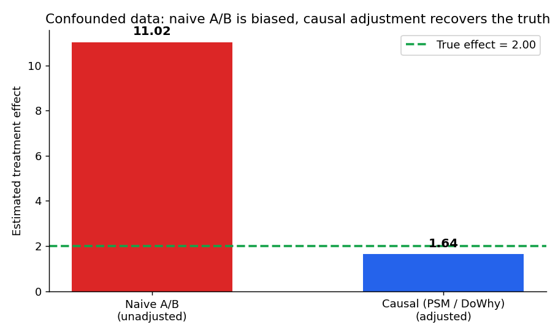

# Causal Experimentation Platform

**Self-serve experiment analysis that flags broken randomization and recovers true effects with causal methods.** Upload (or simulate) experiment data and the app runs a rigorous A/B test, applies causal inference when randomization is broken or impossible, and returns a plain-English **ship / don't ship** verdict with effect sizes and confidence intervals — every number validated against a known ground-truth effect.


---

## Live demo

**[▶ Launch the app](https://datascience3-kcveuawt3683cwsstu8qbt.streamlit.app/)**

Hit **Simulate data** in the sidebar and walk Data → Design check → A/B + CUPED → Causal analysis → Verdict in under a minute, no setup.

---

## The money shot: naive A/B is biased, causal recovers the truth

On **observational** data, treatment is self-selected — power users opt in — so the same confounders drive both who gets treated and the outcome. The naive A/B difference is badly biased. DoWhy's propensity-score matching adjusts for those confounders and recovers the true effect:



The true effect was **2.0**. The naive A/B test reports **11.0** (5x too high). Propensity-score matching recovers **1.6** — close to the truth. The app shows this contrast live, and every method is unit-tested to recover the injected effect. _(Regenerate the chart with `python scripts/make_figures.py`.)_

---

## Methods — and when to use which

| Method | File | Use when |
|---|---|---|
| **Welch t-test / two-proportion z-test** | `src/analysis/ab_test.py` | Clean randomized A/B; continuous or binary outcome. |
| **CUPED** | `src/analysis/cuped.py` | You have a pre-experiment covariate; want a tighter CI / more power without more users. |
| **Power & sample-size** | `src/design/power.py` | *Before* launch: how many users to detect an X% lift, or what's detectable at a given N. |
| **SRM check** | `src/design/srm.py` | Always, as a guardrail: did the split actually come out as intended? A fail invalidates everything. |
| **Difference-in-differences** | `src/analysis/did.py` | Before/after, treatment/control panel where groups differ in level but trend in parallel. |
| **Propensity-score matching (DoWhy)** | `src/analysis/psm.py` | Observational data — treatment was *not* randomized but confounders are observed. |
| **Causal forest (EconML)** | `src/analysis/uplift.py` | Heterogeneous effects: *which segment* responds most, not just the average. |
| **Verdict engine** | `src/report/verdict.py` | Turn the statistics into a ship / don't-ship / inconclusive business call. |

---

## Quickstart

```bash
# Python 3.10–3.12 recommended (DoWhy/EconML wheels)
python -m venv .venv
.venv\Scripts\activate          # Windows;  source .venv/bin/activate on macOS/Linux
pip install -r requirements.txt

streamlit run app.py
```

Run the tests (each method is validated against the known simulated effect):

```bash
pytest            # fast methods + slow causal-model validations
pytest -m "not slow"   # skip the DoWhy/EconML fits
```

---

## How it works

1. **`src/data/simulate.py`** generates data with a **known** treatment effect under two regimes — clean *randomized* and confounded *observational* — plus a pre-period covariate (for CUPED), a heterogeneity segment (for uplift), and a before/after panel (for DiD). This injected truth is the **test oracle**: every method is trusted only because it recovers it.
2. The analysis modules estimate the effect; tests in `tests/` assert each one's CI covers the injected truth (and that the naive estimate is biased where it should be).
3. **`src/report/verdict.py`** combines significance, practical effect size, sample adequacy, and SRM into a plain-English recommendation.
4. **`app.py`** is a thin Streamlit orchestration layer over the tested methods — statistics correctness over UI polish, by design.

```
src/
├── config.py            # all thresholds (alpha, power, MDE, practical floor) in ONE place
├── data/                # simulate.py (ground truth) · validate.py (CSV schema checks)
├── design/              # power.py · srm.py
├── analysis/            # ab_test · cuped · did · psm · uplift
└── report/              # verdict.py
```

---

## Deploy

The app is deploy-ready for **[Streamlit Community Cloud](https://share.streamlit.io)** (free):

1. Push this repo to GitHub (already at `Abhi241-bot/Datascience3`).
2. On Streamlit Community Cloud → **New app** → point at this repo, `app.py`.
3. **In Advanced settings, set Python version to `3.12`** (this is required, not optional).
   DoWhy pulls in `cvxpy`, and the scientific stack has **no wheels for Python 3.13/3.14**,
   so a newer interpreter forces a from-source build that fails on Streamlit Cloud.
   If the app was already created on 3.14, open its **Settings → Python version → 3.12 → Reboot**.
4. Deploy — the public URL goes in the [Live demo](#live-demo) link at the top.

---

## Guardrails this project respects

- **Every method is validated against a known simulated effect** — non-negotiable; it's why the numbers are trustworthy.
- **No database server, no auth, no cloud account** required — `streamlit run app.py` from a fresh clone.
- **One config file** for alpha / power / MDE / thresholds.
- **Statistics correctness > UI polish.**
